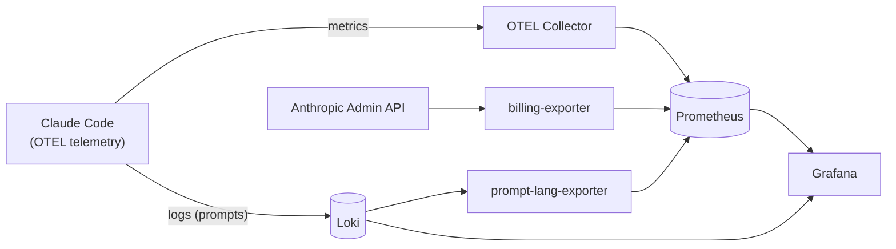
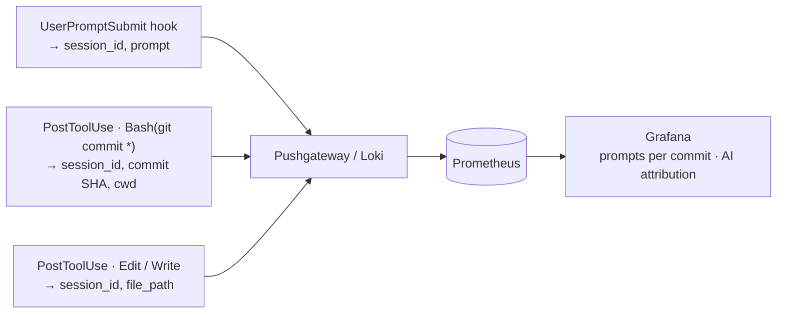

# Claude Code ROI Analytics

An observability stack for measuring the cost, real spend, and ROI of Claude Code
across a development organization. Telemetry flows from Claude Code → OpenTelemetry
→ Prometheus/Loki → Grafana, augmented by exporters that pull **authoritative
billing** from the Anthropic Admin API and enrich prompt data.

## Stack



Run: `docker compose up -d --build` (see [architecture.md](docs/architecture.md) for the full design).

| Component | Purpose |
|-----------|---------|
| `otel-collector-config.yaml` | Ingests OTLP metrics/logs from Claude Code |
| `prometheus.yml` | Metrics storage + scrape config |
| `loki-config.yaml` | Prompt/event log storage |
| `grafana/dashboards/` | Five dashboards by audience — **Overview**, **Real Cost**, **Usage Patterns** (engagement leaderboard + behavior signals), **Developer** (per-user drill-down + timeline), and a **Home** launcher. See [architecture.md](docs/architecture.md#5-grafana-grafana). |
| [`billing-exporter/`](billing-exporter/) | Real billing from the Admin API ([README](billing-exporter/README.md)) |
| [`prompt-lang-exporter/`](prompt-lang-exporter/) | Prompt-language detection from Loki ([README](prompt-lang-exporter/README.md)) |
| [`prompt-intent-exporter/`](prompt-intent-exporter/) | Prompt **intent + behavior** classification (local ONNX model) → Usage Patterns dashboard ([README](prompt-intent-exporter/README.md)) |
| [`prompt-intent-classifier/`](prompt-intent-classifier/) | Trains/evaluates the intent+behavior model (LLM-labeled → distilled); exports ONNX ([README](prompt-intent-classifier/README.md)) |
| `alarms/` | AWS CloudWatch alarms for the stack |

## Cost: estimate vs. real

The OTEL `claude_code_cost_usage_USD_total` metric is an **estimate** (tokens × list
price), not a bill. Real cost is tracked separately by `billing-exporter`:

- **Service / API-key usage** → authoritative metered billing from the **Cost Report API**.
- **Team-seat developers** → flat seat fee (monthly $125 Premium / $25 Standard) **+
  extra usage**. Seat usage is not metered; extra usage is read from claude.ai billing
  (no API — entered in `billing-exporter/seat-roster.yaml`). See the billing-exporter
  README for the full model.

---

## Data sources & APIs available for metrics

Everything we can currently pull, and what additional metrics each unlocks. Use this
as the menu when adding metrics.

### 1. OTEL telemetry → Prometheus (live)
Metrics: `claude_code.cost.usage`, `.token.usage`, `.lines_of_code.count`,
`.pull_request.count`, `.commit.count`, `.session.count`, `.code_edit_tool.decision`.
Labels: `user_email`, `model`, `terminal_type`, `repository_*`, `project_name`, `type`.
- **Unlocks:** cost/tokens/LOC by user/model/project/repo/IDE, cache efficiency,
  tool accept/reject rate, sessions, AI-attributed PRs & commits. *(Most already on the dashboard.)*

### 2. OTEL logs → Loki (live)
`user_prompt` events (text when `OTEL_LOG_USER_PROMPTS=1`), tool-use events.
- **Unlocks:** prompt counts, **prompt language** (`prompt-lang-exporter`), prompt-length
  distribution, tool-usage distribution, prompt-content analysis.

### 3. Anthropic Admin API — needs `sk-ant-admin…` key (live, used by billing-exporter)
| Endpoint | Returns | Granularity |
|----------|---------|-------------|
| `/v1/organizations/cost_report` | **Real billed USD** (discounts applied) | day × model × tier × workspace (not per-user) |
| `/v1/organizations/usage_report/messages` | Token usage | day × api_key_id / account_id / model / tier |
| `/v1/organizations/usage_report/claude_code` | Sessions, LOC, commits, PRs, tool actions, est. cost, `customer_type` | day × actor (api_key or user) |
| `/v1/organizations/users` | Members (email, role) — **no seat type** | per user |
- **Unlocks:** real cost, real token volume, per-key/per-model breakdown, Claude Code
  engagement (sessions/LOC/PRs) per actor. **Blind spots:** per-human cost when API
  keys are shared; Team seat fees & extra usage (claude.ai billing only — no API).

### 4. Claude Code hooks → `.claude/settings.json` (not yet used — biggest opportunity)
Lifecycle hooks (`UserPromptSubmit`, `PostToolUse`, `SessionEnd`, …) run shell commands
that can push custom data to a Pushgateway/Loki/OTLP. Deployable fleet-wide via
server-managed settings (Teams/Enterprise) or managed-settings.json (MDM).
- **Unlocks the metrics OTEL can't** — see [Additional metrics via hooks](#additional-metrics-via-hooks).

### 5. External engineering data — in Power BI today, not wired into Grafana
**Mergestat** (git: commits, PRs, LOC, churn), **STS** (logged hours), **Jira** (issues,
reopen rate). Bringing these into Grafana needs their datasources connected (e.g.
Mergestat Postgres). Kept in Power BI by current choice.

---

## Additional metrics via hooks

Claude Code hooks bridge the gap OTEL can't: they fire **inside** a session at the moment
work happens, so they can stamp git activity with the `session_id`. A `PostToolUse` hook
filtered to `Bash(git commit *)` captures the commit SHA + session_id; a `UserPromptSubmit`
hook counts prompts per session. Joining the two **links prompts to commits** — the metric
the original spec marked "impossible."

| Previously-impossible metric | Hook approach |
|------------------------------|---------------|
| Prompts per commit / per PR | `UserPromptSubmit` + `PostToolUse(git commit)`, joined on `session_id` |
| Commit ↔ Claude session linkage | `PostToolUse(git commit *)` → log SHA + session_id + cwd |
| Files edited by Claude (AI attribution, partial) | `PostToolUse(Edit\|Write)` → log file_path + session_id |
| Tool acceptance vs. rejection | `PermissionRequest` / `PostToolUseFailure` |
| Per-session summary (prompts, edits, commits) | `SessionEnd` → one batch push |



Hook payloads include `session_id`, `cwd`, `tool_name`, `tool_input` (e.g. the Bash
`command`), `tool_result`, and `prompt`. Hooks can `curl` to a Prometheus Pushgateway or
Loki, so they fit this stack directly. Caveats: hooks run as the local user and block the
session until they return (use short timeouts / fire-and-forget), managed hooks prompt a
one-time security approval, and `PostToolUse` only fires on success (use `PostToolUseFailure`
for rejections). See [Claude Code hooks docs](https://code.claude.com/docs/en/hooks).

**Implemented** in [`hooks/`](hooks/): `log-prompt.sh`, `log-commit.sh`, `log-pr.sh`,
`log-edit.sh`, and `session-end.sh` push events to Loki (chosen over a Pushgateway —
per-event `session_id`/SHA data is log-shaped, not metric-shaped). Wire them via
`hooks/settings.example.json` → `.claude/settings.json` (or managed settings org-wide).
A **native git `post-commit` hook** ([`hooks/git/`](hooks/git/)) additionally captures
**every** commit and tags it **AI-assisted vs human** via the `CLAUDECODE` env var — it
runs after the commit with its exit code ignored, so it can never block a developer.
The **"Claude Code - Hooks Metrics"** dashboard computes **prompts per commit**,
**prompts per PR**, and **AI-assisted commit %**. See [`hooks/README.md`](hooks/README.md).

---

## Code quality & security scanning

Linting, formatting, and secret scanning run via [pre-commit](https://pre-commit.com)
locally and in CI (`.gitea/workflows/ci.yml`).

```bash
pip install pre-commit          # or: pipx install pre-commit
pre-commit install              # enable the git hook (runs on every commit)
pre-commit run --all-files      # run the full suite manually
```

What runs:

| Tool | Scope | Config |
| --- | --- | --- |
| [ruff](https://docs.astral.sh/ruff/) | Python lint + format | `ruff.toml` |
| [shellcheck](https://www.shellcheck.net/) | shell scripts | `.shellcheckrc` |
| [hadolint](https://github.com/hadolint/hadolint) | Dockerfiles | `.hadolint.yaml` |
| [gitleaks](https://github.com/gitleaks/gitleaks) | secret scanning | `.gitleaks.toml` |
| pre-commit-hooks | whitespace, YAML/JSON, large files, private keys | `.pre-commit-config.yaml` |

Gitleaks also runs over the **full git history** in CI; locally it scans staged changes.

## Other docs

- [`architecture.md`](docs/architecture.md) — full architecture & metrics data model
- [`claude-code-roi-full.md`](docs/claude-code-roi-full.md) — original implementation guide
- [`report-generation-prompt.md`](docs/report-generation-prompt.md) / [`sample-report-output.md`](docs/sample-report-output.md) — automated reporting
- [`troubleshooting.md`](docs/troubleshooting.md) — common issues
- [`keycloak-plan.md`](docs/keycloak-plan.md) — Keycloak SSO auth plan for Grafana
