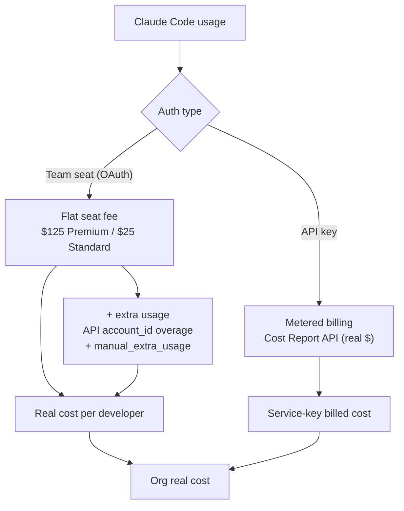

# Billing Exporter — real Claude Code cost

The OTEL telemetry metric `claude_code_cost_usage_USD_total` is an **estimate**
(tokens × API list price). It is **not** what you actually pay — especially for
developers on Team **seats**, whose usage is covered by a flat monthly fee.

This exporter computes the **real** cost and exposes it to Prometheus.

## The cost model

```
real cost per developer = flat seat fee  +  metered overage (extra usage)
org real cost           = Σ seat fees  +  Σ overage  +  service-key billed cost
```



| Bucket | Source | Real $? |
|--------|--------|---------|
| Seat fee (monthly: Premium $125 / Standard $25) | `seat-roster.yaml` (from claude.ai → Admin → Members) | ✅ flat, exact |
| Extra usage / overage (per developer) | Usage Report API, keyed by `account_id`, priced at list rates | ✅ (today $0) |
| Service / automation API keys | Cost Report API (discounts already applied) | ✅ authoritative |

Seat usage is **not** metered and never appears in the Cost Report; service-key
usage never carries an `account_id`. The buckets don't overlap.

> Verified against the live org on 2026-06-08: service-key billed = $752.51/30d,
> seat overage = $0 (no seat usage spills to metered billing). Real cost for a
> Premium-seat developer is the flat monthly seat fee ($125), not the OTEL estimate.

## Setup

1. Put the org **Admin API key** (`sk-ant-admin…`) in `../.secrets/admin-key`
   (gitignored). The exporter mounts it read-only.
2. Copy `seat-roster.example.yaml` → `seat-roster.yaml` (gitignored) and fill in
   every member with their seat type. This is the source of truth for seat fees.
3. `docker-compose up -d --build billing-exporter`
4. Prometheus scrapes `billing-exporter:9105` (job `billing-exporter`).
   Grafana shows it on the **"Claude Code - Real Cost"** dashboard.

## Metrics

| Metric | Labels | Meaning |
|--------|--------|---------|
| `claude_dev_real_cost_usd` | `email`, `seat_type` | seat fee + overage per developer |
| `claude_dev_seat_fee_usd` | `email`, `seat_type` | flat seat fee |
| `claude_dev_extra_usage_usd` | `email` | metered overage attributed to a developer |
| `claude_seat_count` | `seat_type` | number of seats |
| `claude_service_billed_cost_usd` | `model`, `service_tier`, `cost_type` | real metered billing |
| `claude_service_billed_cost_total_usd` | — | total real metered billing |
| `claude_org_real_cost_total_usd` | — | seat fees + overage + service billing |
| `claude_unmapped_extra_usage_usd` | — | overage whose `account_id` isn't in `account_map` |
| `claude_billing_exporter_last_success_timestamp` | — | last good poll |
| `claude_billing_exporter_errors` | — | 1 if last poll failed |

## Config (env)

| Var | Default | Notes |
|-----|---------|-------|
| `POLL_INTERVAL_SECONDS` | `21600` (6h) | billing data lags; slow poll is fine |
| `LOOKBACK_DAYS` | `30` | window for Cost/Usage Report |
| `ADMIN_KEY_PATH` | `/secrets/admin-key` | or set `ANTHROPIC_ADMIN_KEY` |
| `ROSTER_PATH` | `/config/seat-roster.yaml` | reloaded each poll |

## Measuring extra usage (overage)

Verified against this org (Apr/May/Jun 2026): **all** metered usage is attributed
to API keys — `account_id` is null in every record. So:

- **Service/API-key overage** → measured exactly by the Cost Report API. ✅
- **Seat (subscription) overage** → has **never** appeared in the Usage/Cost API.
  Subscription billing is an API blind spot; seat overage may only ever be visible
  in **claude.ai → Admin → Billing**, not via API. Do **not** assume the API will
  capture it.

The exporter therefore measures seat extra usage two ways, summed:

1. **API-detected** — if overage ever shows up with an `account_id`, map that UUID
   → email under `account_map:` and it's priced automatically. (Currently $0.)
2. **Manual fallback** — read per-member overage from claude.ai Admin → Billing and
   record it under `manual_extra_usage:` ({email: usd}). This is the authoritative
   path until/unless the API is shown to capture seat overage.

`claude_unmapped_extra_usage_usd` flags any API overage that arrived with an
`account_id` not in `account_map` (so nothing is silently dropped). Watch it after
the 2026-06-15 Agent-SDK split — that's the first event likely to generate overage.
