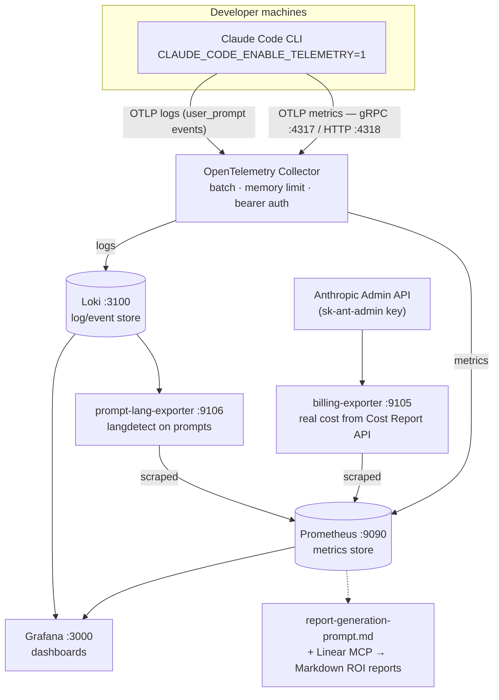
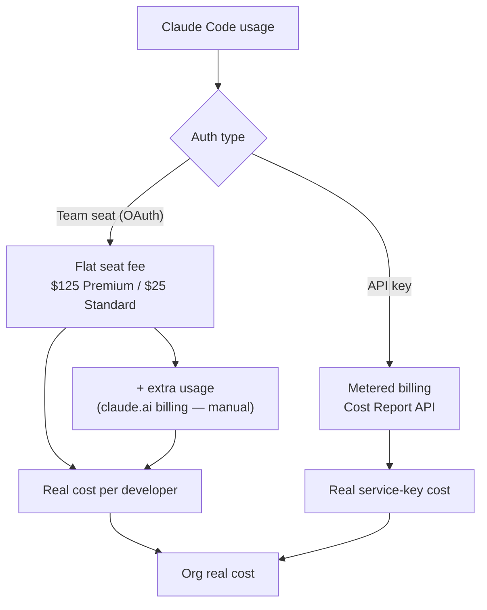
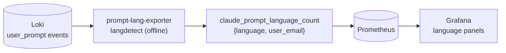

# Claude Code ROI Analytics — Purpose & Architecture

## Purpose

This project is a **production-ready observability framework** for measuring the Return on Investment (ROI) of Claude Code across a development organization. It answers questions like:

- What is our actual spend per developer, per team, per project?
- Which teams get the most value from Claude Code?
- Should we move from pay-per-token to a subscription plan?
- How does Claude Code usage correlate with development velocity (PRs, commits, cycle time)?
- What are our developers actually using Claude Code for?

It is **not a traditional application with business logic code**. It is a declarative infrastructure stack (Docker Compose + configuration files) combined with documentation, Grafana dashboards, and Claude prompt templates for automated report generation.

---

## High-Level Architecture



---

## Components

### 1. Telemetry Source — Claude Code CLI

Claude Code CLI natively emits OpenTelemetry data when telemetry is enabled via environment variables. No instrumentation code is required.

**Required env vars:**
```bash
CLAUDE_CODE_ENABLE_TELEMETRY=1
OTEL_METRICS_EXPORTER=otlp
OTEL_EXPORTER_OTLP_PROTOCOL=grpc
OTEL_EXPORTER_OTLP_ENDPOINT=http://<collector-host>:4317
OTEL_EXPORTER_OTLP_HEADERS="Authorization=Bearer <token>"
OTEL_METRIC_EXPORT_INTERVAL=1000   # ms
```

**Optional (logs user prompts for prompt analysis):**
```bash
OTEL_LOG_USER_PROMPTS=1
```

For organization-wide rollout, these are pushed via `managed-settings.json` through MDM (Mobile Device Management).

**Project-level config** (`.claude/settings.json`):
```json
{
  "env": {
    "OTEL_RESOURCE_ATTRIBUTES": "repository.fullname=org/repo,repository.host=github.com"
  }
}
```
This tags all metrics with repository metadata so cost and usage can be broken down by project.

---

### 2. OpenTelemetry Collector (`otel-collector-config.yaml`)

The central ingestion and routing hub. It receives raw telemetry from Claude Code instances across all developer machines.

| Stage | Config | Details |
|-------|--------|---------|
| **Receivers** | `otlp` | gRPC (:4317), HTTP (:4318), bearer token auth |
| **Processors** | `batch/metrics` | max 1024 spans, 1s timeout |
| **Processors** | `batch/logs` | max 512 entries, 2s timeout |
| **Processors** | `memory_limiter` | 512 MB limit, 64 MB spike |
| **Exporters** | `prometheus` | Exposes metrics at :8889 for Prometheus to scrape |
| **Exporters** | `loki` | Ships logs to Loki HTTP endpoint |
| **Exporters** | `debug` | Console output for troubleshooting |

---

### 3. Prometheus (`prometheus.yml`)

Time-series database for all Claude Code metrics.

- Scrapes OTEL Collector endpoint every **15 seconds**
- Retention: **200 hours**
- Exposes query API at `:9090`
- Hot reload via lifecycle API enabled

**Key PromQL queries:**
```promql
# Total spend
sum(claude_code_cost_usage_USD_total)

# Cost per user
sum(claude_code_cost_usage_USD_total) by (user_id)

# Token breakdown by type (input / output / cache)
sum(claude_code_token_usage_tokens_total) by (type)

# Cost by model (Haiku / Sonnet / Opus)
sum(claude_code_cost_usage_USD_total) by (model)

# Cache efficiency ratio
sum(claude_code_token_usage_tokens_total{type="cacheRead"}) /
sum(claude_code_token_usage_tokens_total{type="cacheCreation"})

# Active users in last 7 days
count(sum by (user_id) (
  increase(claude_code_cost_usage_USD_total[7d]) > 0
))
```

---

### 4. Loki (`loki-config.yaml`)

Log aggregation for structured Claude Code events (especially user prompts when `OTEL_LOG_USER_PROMPTS=1`).

- Storage: Filesystem-backed TSDB (schema v13)
- Retention: **720 hours (30 days)**
- Index period: 24 hours
- Structured metadata enabled

Used for prompt analysis — querying `claude_code_user_prompt` events to understand task categories, prompt quality, and developer behavior patterns.

---

### 5. Grafana (`grafana/`)

Visualization layer. Provisioned automatically on startup via:
- `grafana/provisioning/datasources/datasources.yaml` — connects Prometheus and Loki
- `grafana/provisioning/dashboards/dashboards.yaml` — auto-loads every dashboard JSON file
  (10s refresh; deleting a file removes the dashboard)

**The dashboards are organized by audience** — one job per dashboard, reached from a
**Home launcher** (`home-launcher.json`, the default home dashboard):

| Dashboard | UID | Audience / job | Highlights |
|-----------|-----|----------------|------------|
| **— Overview** | `claude-code-working` | Exec / org overview | Total cost, active users, tokens, LOC, cost by model/project/repo/IDE, prompt language, **+ a Usage Patterns insights row** (main vs subagent, effort, intent mix, mini leaderboard). Defaults to last 30 days. |
| **— Real Cost** | `claude-real-cost` | Finance | Org real cost, Service-key Billed (real) vs OTEL Estimate, Real Cost / Extra Usage per developer, Billed Cost by Model |
| **— Usage Patterns** | `scopic-usage-patterns` | Team enablement / coaching | **Engagement leaderboard**, purpose (intent/behaviors/slash-commands), workflow style (tool mix, main-vs-subagent, effort, model fit, subagent type, session start type), prompt craft & verification, cost discipline, prompt volume & language. Aggregate, coaching-oriented. |
| **— Developer** | `scopic-dev-drilldown` | One-developer deep dive | Per-user cost/tokens/efficiency, project **timeline & activity heatmaps** (hour×day, weekday folds), and that developer's **prompt patterns**. `$user` dropdown. |
| **— Home** | `scopic-home` | Launcher | Cards linking to the four dashboards above |

> The OTEL cost panels are **estimates** (tokens × list price); the Real Cost dashboard
> is the authoritative spend. See [`billing-exporter/README.md`](../billing-exporter/README.md).

**Usage-pattern signals.** Beyond cost, the stack reads richer behavioral attributes from
the `claude_code.cost.usage` metric (`query_source` = main/subagent/auxiliary, `effort`,
`speed`, `agent.name`, `skill.name`) and `claude_code.session.count` (`start_type` =
fresh/resume/continue), plus prompt **intent** and **behaviors** classified locally (Loki
streams `claude-code-intent` / `-behavior` / `-command`). These drive the Usage Patterns
and Developer dashboards. Prompt text is classified on the analytics box and never leaves it.

Deployed at: `https://grafana.claude-analytics.scopicdev.com`

---

### 6. Real-Cost & Prompt-Language Exporters

Two Python sidecars enrich the stack with data OTEL alone can't provide:



- **`billing-exporter`** (`:9105`) — polls the Anthropic Admin API (Cost Report + Usage
  Report), reads `seat-roster.yaml`, and emits real per-developer and org cost. Extra
  usage is summed from API-detected overage (per `account_id`) plus a manual entry from
  claude.ai billing (Team extra usage has no API).
- **`prompt-lang-exporter`** (`:9106`) — reads `user_prompt` events from Loki, detects
  language with `langdetect`, and emits `claude_prompt_language_count`.



---

### 7. Automated Report Generation (`report-generation-prompt.md`)

A Claude Code prompt template that, when run with the Linear MCP connected, generates a full Markdown ROI report combining:

- Prometheus metrics (cost, token usage, adoption)
- Linear data (sprint velocity, issue completion, cycle time)
- Mermaid charts (pie charts, bar charts, timelines)
- Actionable recommendations (subscription plan optimization, team coaching)

Run via:
```bash
claude -p "$(cat docs/report-generation-prompt.md)"
```

Sample output is in `sample-report-output.md`.

---

## Metrics Data Model

### Emitted by Claude Code (OTLP → Prometheus/Loki) — *estimated cost*

| Metric | Type | Unit | Key Attributes |
|--------|------|------|----------------|
| `claude_code.cost.usage` | Counter | USD (est.) | `user_id`, `session_id`, `model`, `user_email`, `project_name` |
| `claude_code.token.usage` | Counter | tokens | `user_id`, `type` (input/output/cacheCreation/cacheRead), `model` |
| `claude_code.lines_of_code.count` | Counter | lines | `user_id`, `type` (added/modified/deleted) |
| `claude_code.pull_request.count` | Counter | count | `user_id`, `model` |
| `claude_code.commit.count` | Counter | count | `user_id`, `model` |
| `claude_code.session.count` | Counter | count | `user_id` |
| `claude_code.code_edit_tool.decision` | Counter | count | `user_id`, `decision` (accept/reject), `tool_name` |
| `claude_code.user_prompt` | Log/Event | — | `user_id`, `prompt_text`, `prompt_length`, `model` |

> `claude_code.cost.usage` is an **estimate** (tokens × list price). For real spend, use
> the exporter metrics below.

### Emitted by `billing-exporter` (Admin API → Prometheus) — *real cost*

| Metric | Unit | Key Labels |
|--------|------|------------|
| `claude_dev_real_cost_usd` | USD | `email`, `seat_type` |
| `claude_dev_seat_fee_usd` | USD | `email`, `seat_type` |
| `claude_dev_extra_usage_usd` | USD | `email` |
| `claude_service_billed_cost_usd` | USD | `model`, `service_tier`, `cost_type` |
| `claude_service_billed_cost_total_usd` | USD | — |
| `claude_org_real_cost_total_usd` | USD | — |

### Emitted by `prompt-lang-exporter` (Loki → Prometheus)

| Metric | Unit | Key Labels |
|--------|------|------------|
| `claude_prompt_language_count` | count | `language`, `user_email` |
| `claude_prompt_language_prompts_total` | count | — |

---

## ROI Calculation Logic

**Cost per output unit:**
```
Cost per PR     = total_cost / pr_count
Cost per commit = total_cost / commit_count
Cost per LOC    = total_cost / lines_added
```

**Subscription vs pay-per-token decision:**
```
Monthly API spend (per user) vs subscription tier:
  Pro:    $20/user/month
  Max 5x: $100/user/month
  Max 20x: $200/user/month

If actual spend > tier cost → subscription is cheaper
```

**Cache efficiency:**
```
Cache ratio = cacheRead_tokens / cacheCreation_tokens
Higher ratio = better amortization of context costs
Target: > 10:1
```

**Productivity velocity (correlated with Linear):**
```
Commits/week:    before vs after Claude Code adoption
Review cycles:   fewer = better code quality
Merge time:      hours from PR open to merge
PR size:         smaller = more focused changes
```

---

## Deployment

### Local (Development)
```bash
docker-compose up -d
```

Services:
| Service | Port | Purpose |
|---------|------|---------|
| `otel-collector` | 4317, 4318, 13133 | Telemetry ingestion |
| `prometheus` | 9090 | Metrics storage + query |
| `loki` | 3100 | Log storage |
| `grafana` | 3000 | Dashboards |
| `billing-exporter` | 9105 | Real cost from the Admin API (needs `.secrets/admin-key` + `seat-roster.yaml`) |
| `prompt-lang-exporter` | 9106 | Prompt-language detection from Loki |
| `prompt-refactor-exporter` | 9109 | Rephrase-pair detection + tokens/latency-saved estimate from `hooks/lint-prompt.sh` events |

Persistent volumes: `prometheus_data`, `grafana_data`, `loki_data`

### Organization-Wide
1. Deploy the full stack (collector + Prometheus + Loki + Grafana + exporters) on a shared server or ECS/Kubernetes
2. Configure DNS → `https://grafana.claude-analytics.scopicdev.com`
3. Push environment variables to all developer machines via MDM using `managed-settings.json`
4. Set `OTEL_EXPORTER_OTLP_ENDPOINT` to point at the shared collector
5. Provide the Admin API key and seat roster to `billing-exporter`; optionally deploy
   metric-collection **hooks** fleet-wide via managed settings (see README)

---

## File Reference

| File | Purpose |
|------|---------|
| `docker-compose.yml` | Spins up the full observability stack |
| `otel-collector-config.yaml` | OTEL Collector pipeline configuration |
| `prometheus.yml` | Prometheus scrape config and retention |
| `loki-config.yaml` | Loki log storage configuration |
| `grafana/provisioning/` | Auto-provisioning for dashboards and data sources |
| `grafana/dashboards/home-launcher.json` | Home launcher — cards linking to the four dashboards |
| `grafana/dashboards/working-dashboard.json` | **Overview** — org cost/usage + Usage Patterns insights row |
| `grafana/dashboards/real-cost-dashboard.json` | **Real Cost** — real per-developer cost dashboard |
| `grafana/dashboards/usage-patterns-dashboard.json` | **Usage Patterns** — engagement leaderboard, purpose, workflow style, prompt craft, cost discipline, prompt volume/language |
| `grafana/dashboards/developer-drilldown-dashboard.json` | **Developer** — per-user cost/usage + timeline/activity heatmaps + prompt patterns (`$user`) |
| `billing-exporter/` | Real-cost exporter (Admin API → Prometheus) |
| `prompt-lang-exporter/` | Prompt-language exporter (Loki → Prometheus) |
| `prompt-refactor-exporter/` | Rephrase-pair detection + tokens/latency-saved estimate (Loki → Prometheus) |
| `hooks/` | Claude Code hooks → Loki (prompts/commit, prompts/PR, commit↔session, prompt-lint scores) |
| `grafana/dashboards/hooks-dashboard.json` | Hooks metrics dashboard |
| `docs/claude-code-roi-full.md` | Complete implementation guide with examples and PromQL queries |
| `docs/report-generation-prompt.md` | Claude prompt template for automated ROI reports |
| `docs/sample-report-output.md` | Example of a generated report with Mermaid charts |
| `docs/troubleshooting.md` | Common issues: auth failures, missing metrics, performance |
| `docs/keycloak-plan.md` | Keycloak SSO auth plan for Grafana (admins-only roles) |
| `.claude/settings.json` | Project-level OTEL resource attribute tags |
