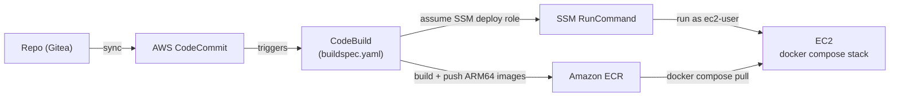

# CI/CD — Build & Deploy

How code and config get from the repo onto the production EC2 box. The whole pipeline is a
single [`buildspec.yaml`](../buildspec.yaml) run by AWS CodeBuild.

## Workflow



1. **Source** — the repo is synced to CodeCommit; CodeBuild runs `buildspec.yaml`.
2. **`pre_build`** — log in to ECR.
3. **`build`** — for each app service, `docker buildx build --platform linux/arm64`, then
   push two tags to ECR: the immutable `:${CODEBUILD_BUILD_NUMBER}` and a moving `:latest`.
   (Images are **arm64** because the box is Graviton/ARM.)
4. **Deploy** — CodeBuild assumes `SSM_DEPLOY_ROLE_ARN` and sends one `AWS-RunShellScript`
   to the instance. On the box, **as `ec2-user`**, it:
   - decodes the config bundle (shipped **inline** as tar+gzip+base64 — no S3) into the
     compose dir,
   - logs in to ECR,
   - rewrites each app service's `image:` tag in the compose files with `yq`,
   - `docker compose pull` + `up -d` the app services (recreates them on the new image),
   - `docker compose restart` the config-only services so they re-read their config,
   - prunes dangling images.
5. CodeBuild waits on the SSM command and fails the build if the deploy didn't succeed.

## What it deploys

**App images** — all four share the **single** ECR repo `IMAGE_REPO_NAME`
(`your-org/claude-code-roi-analytics`); the service is encoded in the **tag**, not a
sub-repo (ECR doesn't auto-create sub-repos). Each push gets `<service>-<build#>` and
`<service>-latest`:

| Service | Build context | ECR image (tag) |
|---------|---------------|-----------------|
| web | `./web` | `…/claude-code-roi-analytics:claude-roi-web-<build#>` |
| billing-exporter | `./billing-exporter` | `…:billing-exporter-<build#>` |
| prompt-lang-exporter | `./prompt-lang-exporter` | `…:prompt-lang-exporter-<build#>` |
| prompt-intent-exporter | `./prompt-intent-exporter` | `…:prompt-intent-exporter-<build#>` |

**Config files** (the `CONFIG_PATHS` var — host bind-mounts, shipped inline and restarted):

| File / dir | Service | Applied by |
|------------|---------|------------|
| `otel-collector-config.yaml` | otel-collector | restart |
| `prometheus.yml` | prometheus | restart |
| `loki-config.yaml` | loki | restart |
| `grafana/provisioning` | grafana | restart (datasources apply at startup) |
| `grafana/dashboards` | grafana | restart (also hot-reloads on its own) |

> `billing-exporter/seat-roster.yaml` is **gitignored / box-local** (like `.env`), so it is
> **not** shipped — it stays on the box.

So a deploy ships **4 code images + 5 config paths**, then recreates the app services and
restarts the config-only ones (prometheus, loki, otel-collector, grafana). The config bundle
rides **inline inside the SSM command** (tar→gzip→base64); it's currently ~30 KB gzipped,
well under SSM's limit, but grafana dashboards dominate it — if they grow a lot, move them
to a separate transport.

## What it does NOT deploy

- **Compose topology.** The buildspec only rewrites the `image:` tag of the four app
  services *in place* on the box — it does **not** copy `docker-compose.yml` /
  `web/docker-compose.web.yml` from the repo. Adding/removing a service, or changing env
  vars, ports, `mem_limit`, `depends_on`, or volumes does **not** propagate. Those are still
  a manual edit on the box.
- **Pinned third-party image versions.** `otel-collector`, `prometheus`, `loki`, and the
  grafana base image are pinned in compose and pulled from Docker Hub. Version bumps are
  manual (compose edit on the box).
- **The grafana custom image.** `grafana/Dockerfile` (Token Guard branding — logos, title,
  favicons) is **not** rebuilt or pushed. Branding changes need a manual `docker build`.
- **Secrets / box state.** The box's `.env` (`OTEL_AUTH_TOKEN`, `KEYCLOAK_*`,
  `DASHBOARD_*`) and `.secrets/admin-key` are never touched — secrets stay on the box.
- **Non-stack repo dirs.** `prompt-intent-classifier/` (model training), `prompt-explorer/`
  (local tooling), `alarms/` (CloudWatch CloudFormation), `tools/`, `hooks/`.

Mental model: **the pipeline ships code (4 ECR images) + config files and restarts. It does
not ship compose structure, third-party version bumps, the grafana image, or secrets.**

## CodeBuild environment variables

You must set these on the CodeBuild project:

| Variable | Example |
|----------|---------|
| `AWS_ACCOUNT_ID` | `<AWS_ACCOUNT_ID>` |
| `IMAGE_REPO_NAME` | `your-org/claude-code-roi-analytics` |
| `SSM_DEPLOY_ROLE_ARN` | `arn:aws:iam::<AWS_ACCOUNT_ID>:role/dev-claude-code-roi-analytics-role-ssm-deploy` |
| `DEPLOY_COMPOSE_DIR` | `/home/ec2-user/claude-analytics` |

`AWS_DEFAULT_REGION` and `CODEBUILD_BUILD_NUMBER` are provided by CodeBuild automatically;
`CODEBUILD_BUILD_NUMBER` becomes the image tag. (`CONFIG_PATHS` controls which config files
ship; the other `env.variables` in the buildspec are unused leftovers.)

## Box prerequisites

- **`yq`** (mikefarah, arm64) — used to rewrite the compose `image:` tags. The deploy
  **self-installs** it to `/usr/local/bin` if missing, so no manual setup is needed.
- **`ec2-user`** can run `docker` and `aws`; the **instance role** allows **ECR pull**
  (`AmazonEC2ContainerRegistryReadOnly`) and the instance is reachable via **SSM**.
- The compose files already exist at `DEPLOY_COMPOSE_DIR`; the pipeline sets their `image:`
  refs (`yq` adds the line if missing, so a `build:`-only compose is fine the first time).

## Rollback

Every build pushes an immutable `<service>-<build#>` tag, so to roll back, point the service
at an older tag and recreate it on the box:

```bash
cd /home/ec2-user/claude-analytics
yq -i '.services.web.image = ".../claude-code-roi-analytics:claude-roi-web-<old-build#>"' web/docker-compose.web.yml
docker compose -f docker-compose.yml -f web/docker-compose.web.yml up -d web
```
