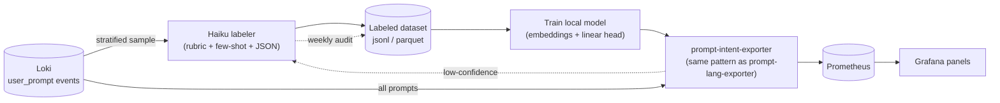

# Prompt Intent & Behavior Classification — Plan

## Goal

We are a software services (outsourcing) company. We want to **understand how our
developers actually use Claude Code, and use that understanding to support them to
work better** — through coaching, enablement, better tooling, and spreading good
practices. This is an *enablement* tool, not a *surveillance* tool, and the design
choices below follow from that.

Concretely, we want to classify each prompt by:

- **Intent** — what the developer is trying to accomplish.
- **Behavior** — *how* they are working with the tool (the signals that point to a
  support action).

…cheaply enough to run continuously over every prompt, and privately enough that
prompt content never leaves the organization in steady state.

## Guiding principle

> Every tag must map to a concrete support action. If seeing a tag does not change
> what we'd do to help a developer or a team, we don't add it.

This filter is what keeps the taxonomy small, defensible, and useful.

---

## Approach: LLM-as-labeler → local distillation

We use a high-quality model once to build a labeled dataset, then train a cheap
local model that runs forever at near-zero marginal cost.

**Why this shape:**

- **Haiku as teacher** gives high-quality multi-label tags from a written rubric.
- **The labeled dataset is the real asset** — it outlives any single model and lets
  us re-train or re-taxonomize later without re-paying.
- **Local student (distilled model)** is offline, free, fast, and keeps prompt
  content in-house. Once trained it can be re-run over *all* historical prompts for
  free.
- **Active learning loop** — the student's low-confidence predictions are routed back
  to Haiku, and a small weekly Haiku audit detects drift. This keeps accuracy from
  rotting without ongoing per-prompt LLM cost.

This slots directly into the existing stack: it mirrors `prompt-lang-exporter`
(poll Loki → classify → materialize Prometheus gauges → Grafana reads cheap gauges).

---

## Taxonomy (v1)

Two independent axes. **Intent** is roughly one-per-prompt; **Behaviors** are
multi-label (zero or many, and they can co-occur).

### Intent (one primary per prompt)

| Intent | What it captures | Why it matters for us |
|---|---|---|
| `feature` | Building new functionality | Core billable build work |
| `debug` | Diagnosing / fixing broken behavior | High `debug` share on a project can signal a brittle codebase or unclear requirements |
| `understand` | Comprehension — "how does X work", reading code | Devs constantly ramp onto unfamiliar client codebases; this is where onboarding support pays off |
| `refactor` | Restructuring without behavior change | Quality investment |
| `test` | Writing / fixing tests | Quality discipline — client-facing |
| `ops` | CI, deploy, env, config, infra | Where time is often lost to friction |
| `other` | Anything that doesn't fit cleanly | Keeps the other buckets honest |

(`planning/design`, `docs`, and `review` are strong candidates for v2 once the core
set is proven accurate.)

### Behavior (multi-label), grouped by the support lever it unlocks

**Specification quality → prompt-craft coaching**

| Behavior | Signal | Support action |
|---|---|---|
| `well-specified` | Clear goal, context, constraints | A good example — harvest to *teach* others |
| `underspecified` | Vague, missing context | Targeted prompt-writing enablement |

**AI-collaboration skill → enablement / pairing**

| Behavior | Signal | Support action |
|---|---|---|
| `stuck-looping` *(sequence-level)* | Same ask re-tried, no progress | Just-in-time support — pair, escalate. The most actionable single tag |

**Quality discipline → guardrails**

| Behavior | Signal | Support action |
|---|---|---|
| `verifies-output` | Asks to test / check / review the AI's work | The behavior we want to reward and normalize |
| `scope-expansion` *(sequence-level)* | "Also add…" beyond the original task | Early signal that work is drifting wider than scoped |

> **Sequence-level tags** (`stuck-looping`, `scope-expansion`) cannot be judged from a
> single prompt — they depend on the prior prompts in the session. The Haiku labeler
> sees the prior N prompts for these, and the local student uses session features
> (retry count, similarity-to-previous prompt, time gaps) alongside the text.

### Tags we deliberately exclude

- **Characterological judgments** (`lazy`, `weak`, `skilled`, etc.). They are
  unactionable — you can't coach someone out of a personality label — and they turn an
  enablement tool into a surveillance tool the moment a manager reads them. We use
  *observational, situation-based* tags (`underspecified`, `stuck-looping`) that point
  at a fixable situation instead.
- **Fine-grained tech tags** (`react`, `sql`, …). We already get repo / project labels
  from OTEL; no need to relearn them from prompt text.
- **Broad sentiment analysis.** Diminishing returns and high noise.

---

## Governance & privacy (non-negotiable)

Because this reads prompt content and could profile individuals, the framing has to
be protected by design:

1. **Default reporting is team / aggregate level.** Per-developer drill-down is a
   deliberate, access-controlled decision — not the default dashboard.
2. **Tags describe situations, not people.** No characterological labels (see above).
3. **Content stays in-house** in steady state. The local student needs no external
   API; only the bounded sampling/audit stream touches Haiku.
4. **The purpose is stated and honored:** find moments to help. Tags are an input to
   support, not an input to ranking or evaluation.

This is worth agreeing on explicitly with Nhat before any code ships — it's a
one-way trust decision with the dev team.

---

## What this can and cannot answer

- **Can:** *how* people work — intent mix, specification quality, collaboration
  patterns, where developers get stuck or lose time. This is the enablement signal.
- **Cannot (alone):** *who is effective.* Outcome questions (delivery speed, quality,
  velocity) require outcome data — PRs/commits/LOC (OTEL + Mergestat) and Jira/STS
  velocity — joined to the intent/behavior data. Intent classification is one new
  dimension, not a verdict. Keeping this distinction explicit prevents the analysis
  from being oversold.

---

## Model choice

- **Start with: local sentence-embeddings (e.g. MiniLM) + one logistic-regression
  head per label.** CPU-only, retrains in seconds, interpretable, and reaches
  ~85–90% on coarse intent with a few hundred examples per class.
- **Escalate only if needed:** fine-tune a small transformer (DistilBERT/MiniLM) for
  a specific subtle tag (`stuck-looping`, `underspecified`) that underperforms. Don't
  start here.

The **rubric + few-shot examples are the highest-leverage artifact** — the student
can never be more accurate than the labels, and the labels can never be better than
the rubric.

---

## Phased roadmap

**Phase 0 — Align (this doc).** Lock the v1 taxonomy and the governance principles
with Nhat. Output: agreed tag list + definitions.

**Phase 1 — Rubric & labeler.** Write the labeling rubric (one-line definition + 2–3
few-shot examples per tag) and a JSON output schema. Build `prompt-intent-labeler`
(modeled on the existing exporter). Label a stratified sample of ~2–5k prompts with
Haiku. *Cost: a few dollars.* Output: versioned labeled dataset.

**Phase 2 — Validate labels.** Spot-check + measure inter-label agreement on a subset.
Fix the rubric where Haiku is inconsistent, re-label. Output: trusted dataset + a
known label-quality number.

**Phase 3 — Train the student.** Embeddings + linear heads, held-out test split,
per-label precision/recall. Output: local model + accuracy report.

**Phase 4 — Deploy & backfill.** Wrap the model in `prompt-intent-exporter`, emit
gauges, backfill over historical Loki prompts. Output: live metrics.

**Phase 5 — Dashboards & loop.** Grafana panels (aggregate-first). Stand up the weekly
Haiku audit + active-learning loop. Output: running enablement signal + drift control.

---

## Metrics output (Prometheus gauges)

Following the `prompt-lang-exporter` pattern:

| Metric | Labels | Meaning |
|---|---|---|
| `claude_prompt_intent_count` | `intent`, `user_email` | prompts by intent over the window |
| `claude_prompt_behavior_count` | `behavior`, `user_email` | behavior-tag occurrences over the window |
| `claude_prompt_intent_prompts_total` | — | prompts processed last poll |
| `claude_prompt_intent_model_version` | `version` | which student model produced current labels |

(Per-user labels exist in the data; dashboards default to aggregate views per the
governance section.)

---

## How this supports the original questions

- **Usage / spend variance** — intent mix + behavior tags, joined to the cost and
  token metrics already in Prometheus, test *why* usage differs (e.g. long agentic
  build loops vs. short comprehension Q&A).
- **Where developers need help** — `stuck-looping` and `underspecified`, surfaced per
  team, are direct triggers for pairing, enablement, or better task specs.
- **Spreading good practice** — `well-specified` and `verifies-output` examples show
  what good usage looks like, so it can be taught rather than assumed.

The effectiveness / delivery-speed questions remain dependent on wiring in the
outcome data (PRs, Jira, STS), which is a separate, complementary effort.
