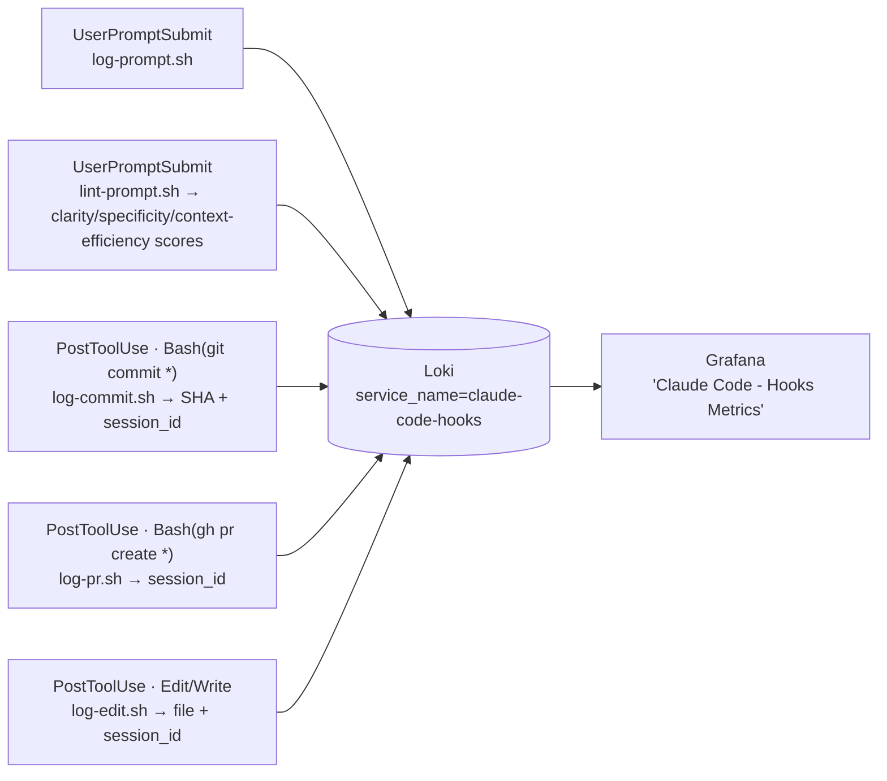

# Claude Code metric hooks

Hooks capture metrics OTEL telemetry can't — most importantly **prompts per commit**
and **prompts per PR** — by firing *inside* a Claude Code session at the moment work
happens and stamping git activity with the `session_id`.



## Why Loki, not a Pushgateway

These are per-event records with high-cardinality fields (`session_id`, commit SHA).
Pushing those as Prometheus labels via a Pushgateway would explode cardinality. Loki
is built for high-cardinality log events with query-time aggregation, and it's already
in the stack — so hooks `POST` to Loki and Grafana derives the ratios with LogQL.

## Events logged

| Script | Hook event | Logged (Loki `event=`) | Fields |
|--------|-----------|------------------------|--------|
| `log-prompt.sh` | `UserPromptSubmit` | `prompt` | session_id, cwd, prompt, prompt_length |
| `lint-prompt.sh` | `UserPromptSubmit` | `prompt_lint` | session_id, user_email *(local `git config`, best-effort)*, char_count, word_count, clarity, specificity, context_efficiency, overall *(no text)* |
| `log-commit.sh` | `PostToolUse` Bash `git commit` | `commit` | session_id, commit_sha, repo, cwd |
| `log-pr.sh` | `PostToolUse` Bash `gh pr create` | `pr` | session_id, pr_url, cwd |
| `log-edit.sh` | `PostToolUse` Edit/Write/MultiEdit | `edit` | session_id, file, tool |
| `session-end.sh` | `SessionEnd` | `session_end` | session_id, reason |
| `git/post-commit` | native git hook (every commit) | `git_commit` | commit_sha, author, branch, repo, session_id, **ai_assisted**, lines_added/deleted, files |

**Discrepancy:** `log-prompt.sh` currently pushes the **full prompt text** to Loki
(`prompt` field) — despite this doc previously stating text isn't stored. That's a
pre-existing tradeoff, not changed here. `lint-prompt.sh` is deliberately different:
it computes scores locally and pushes only counts/scores, **never prompt text**, so it
doesn't compound that exposure.

## Install

1. Make sure the scripts are executable: `chmod +x hooks/*.sh`
2. Merge `settings.example.json` into `.claude/settings.json` (project) — or into
   `managed-settings.json` for org-wide rollout (uses an absolute path, applies to all
   developers, shows a one-time security-approval dialog).
3. Set `CLAUDE_HOOK_LOKI_URL` (and `CLAUDE_HOOK_LOKI_AUTH` if Loki needs auth) so the
   hook can reach Loki. Developer machines must be able to POST to it.
4. The **"Claude Code - Hooks Metrics"** Grafana dashboard auto-loads.

## Config (env)

| Var | Default | Notes |
|-----|---------|-------|
| `CLAUDE_HOOK_LOKI_URL` | `http://localhost:3100` | Loki base URL |
| `CLAUDE_HOOK_LOKI_AUTH` | — | optional, e.g. `Bearer <token>` |
| `CLAUDE_HOOK_DRY_RUN` | `0` | `1` prints the Loki payload instead of sending (testing) |

## Metrics (LogQL)

```logql
# prompts per commit (over the dashboard range).
# NOTE: plain division — Loki LogQL does NOT support clamp_min(). With zero commits
# the result is empty ("No data"), which is the correct semantics for the ratio.
sum(count_over_time({service_name="claude-code-hooks", event="prompt"} [$__range]))
/ sum(count_over_time({service_name="claude-code-hooks", event="commit"} [$__range]))

# prompts per PR
sum(count_over_time({service_name="claude-code-hooks", event="prompt"} [$__range]))
/ sum(count_over_time({service_name="claude-code-hooks", event="pr"} [$__range]))

# commits linked to sessions (table/logs)
{service_name="claude-code-hooks", event="commit"} | json
```

## Test without a session

```bash
export CLAUDE_HOOK_DRY_RUN=1
echo '{"session_id":"s1","cwd":"/repo","tool_input":{"command":"git commit -m wip"}}' | hooks/log-commit.sh
echo '{"session_id":"s1","cwd":"/repo","prompt":"maybe fix the thing idk?"}' | hooks/lint-prompt.sh
```

## Native git hook (all commits + AI-vs-human attribution)

The Claude Code `PostToolUse(git commit)` hook only catches commits made **through
Claude**. A native git `post-commit` hook (`hooks/git/post-commit`) fires on **every**
commit — terminal, IDE, or Claude — and tags each as AI-assisted using the
**`CLAUDECODE`** env var Claude Code exports to subprocesses. It also reads
`CLAUDE_CODE_SESSION_ID`, so AI commits still link to a session.

```bash
# install into the current repo (chains any existing post-commit hook)
hooks/git/install.sh
export CLAUDE_HOOK_LOKI_URL="http://<loki-host>:3100"
```

**Safe for developers:** `post-commit` runs *after* the commit and git ignores its
exit code, so it can **never block or fail a commit**. The push is fire-and-forget
(verified: a commit with Loki unreachable completed in ~24 ms). Best-effort — if Loki
is down the event is dropped, the commit is unaffected.

| | Claude `PostToolUse` hook | Native git `post-commit` |
|--|--------------------------|--------------------------|
| Coverage | commits made via Claude only | **every** commit |
| Session link | yes (`session_id`) | yes, when AI (`CLAUDE_CODE_SESSION_ID`) |
| AI vs human | n/a (all are Claude) | **yes** (`CLAUDECODE` present?) |
| LOC / files | no | yes (`git show --numstat`) |
| Can block a commit? | no | no (exit code ignored) |

Validated LogQL (events under `event="git_commit"`):

```logql
# AI-assisted commit fraction
sum(count_over_time({service_name="claude-code-hooks", event="git_commit"} | json | ai_assisted="true" [$__range]))
/ sum(count_over_time({service_name="claude-code-hooks", event="git_commit"} [$__range]))

# LOC added, AI vs human
sum by (ai_assisted) (sum_over_time({service_name="claude-code-hooks", event="git_commit"} | json | unwrap lines_added [$__range]))
```

For org-wide rollout, distribute via a git template dir (`git config --global
init.templateDir`) or `core.hooksPath`; mind that `core.hooksPath` replaces the whole
hooks dir.

## Caveats

- Hooks run as the local user and would block the session until they return — these
  fire-and-forget the `curl` with a 3s cap, so a slow/unreachable Loki won't stall Claude.
- `PostToolUse` only fires on **success** — a failed `git commit` logs nothing (intended).
- A commit made outside a `git commit` Bash call (e.g. an IDE GUI) won't be captured.
- Managed-settings hooks require a one-time user approval on each machine.

See the [Claude Code hooks docs](https://code.claude.com/docs/en/hooks).
