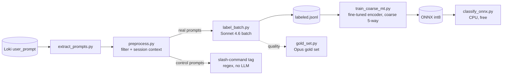

# Prompt Intent & Behavior Classifier

Classifies each Claude Code prompt by **intent** and **behavior** so the org can
understand how developers work and where to support them. Built as a
**LLM-as-labeler → local distillation** pipeline (see
[`../docs/prompt-intent-classification-plan.md`](../docs/prompt-intent-classification-plan.md)).



## Pipeline

| Step | Script | What it does |
|---|---|---|
| 1. Extract | `extract_prompts.py` | Pull all `user_prompt` events from Loki → `data/prompts_raw.jsonl` |
| 2. Study | `analyze_corpus.py` | Profile lengths, sessions, noise (see [`PATTERNS.md`](PATTERNS.md)) |
| 3. Preprocess | `preprocess.py` | Drop injected blocks, route slash-commands to a `control`/command tag, attach prior-prompt context |
| 4. Taxonomy | `taxonomy.py` | Intent + behavior labels, rubric, few-shot, structured-output schema |
| 5. Smoke test | `label_test.py` | Synchronous Sonnet/Haiku labels on ~18 prompts to eyeball the rubric |
| 6. Label | `label_batch.py submit` / `fetch` | Label the full corpus via the Batch API (50% off) → `data/labeled.jsonl` |
| 7. Quality | `gold_set.py label` / `compare` | Opus gold set; intent agreement + per-behavior P/R vs Sonnet |
| 8. Train | `train_ft.py` / `ft2` / `ft3` (fine-tuned, 7-way) · `train_coarse_mt.py` (v5, coarse 5-way) | **committed bundle: `train_coarse_mt.py`** — coarse intents + balanced behaviors (ft3 = 7-way alternative) |
| 9. Export | `export_onnx.py` | trained `.pt` → ONNX int8 + tokenizer → `data/onnx/` (defaults to the coarse_mt checkpoint) |
| 10. Tune | `tune_thresholds.py` | per-behavior decision thresholds → injected into `data/onnx/meta.json` (run after export) |
| 11. Classify | `classify_onnx.py` | **deploy:** onnxruntime + tokenizers only (no torch/transformers), CPU, selective-prediction abstain |

## Deployment (low-end box: 2 vCPU / 7.6 GB RAM / 13 GB disk)

Ship `data/onnx/` (≈140 MB) + `pip install onnxruntime tokenizers numpy` (~215 MB).
~32 ms/prompt CPU; hourly batch of ~300 prompts ≈ 10 s. See [`EVAL.md`](EVAL.md) for the
full model/accuracy/footprint comparison and the selective-prediction (abstain) thresholds.

## Taxonomy (v1)

- **Intent** (one per prompt, what we *label*): `feature` `debug` `understand` `refactor` `test` `ops` `other`
- **Committed-bundle intents** (coarse 5-way the model *emits*, via `train_coarse_mt.py`): `build` (=feature+refactor) `investigate` (=debug+understand) `ops` `test` `other`
- **Behaviors** (multi-label): `well-specified` `underspecified` `verifies-output` `stuck-looping`* `scope-expansion`*
  - *sequence-level — judged using the prior prompts of the session.
- **Command** (regex, control prompts only): the slash-command name (`/plan`, `/verify`, `/clear`, …)

## Run

```bash
set -a; . ../.env; set +a          # ANTHROPIC_API_KEY
python src/extract_prompts.py       # needs local Loki at :3100 (online backup restored)
python src/label_batch.py submit    # ~$28 on Sonnet 4.6 for ~9.7k prompts
python src/label_batch.py fetch     # after the batch ends
python src/gold_set.py label && python src/gold_set.py compare
python src/train_coarse_mt.py       # coarse 5-way student (matches the committed bundle)
python src/export_onnx.py           # -> data/onnx/ (defaults to the coarse_mt model)
python src/tune_thresholds.py       # inject per-behavior thresholds into meta.json
python src/classify_onnx.py         # smoke-test the exported bundle
```

## Design notes

- **Teacher = Sonnet 4.6** (chosen for label quality; ~$28/full corpus via batch).
  **Student = multilingual MiniLM + linear heads** — CPU-only, retrains in seconds,
  runs free over all history.
- **Multilingual embeddings** (`paraphrase-multilingual-MiniLM-L12-v2`) — ~16% of
  real prompts are non-English.
- **Context augmentation** (`prev >>> current` + sim-to-prev + position) gives the
  linear heads the signal for the two sequence-level behaviors.
- `data/` is gitignored (contains prompt content).
