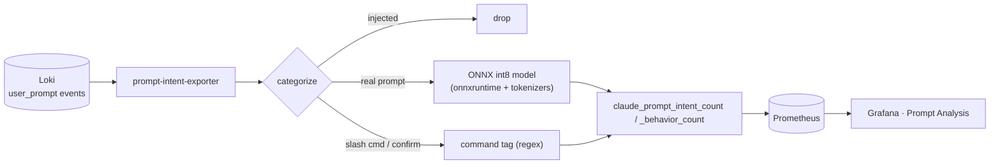

# Prompt-intent exporter

Classifies each Claude Code prompt by **intent** and **behavior** with a local
fine-tuned model and exposes per-intent / per-behavior / per-command counts to
Prometheus for the **Prompt Analysis** Grafana dashboard.



- **Source:** `user_prompt` events in Loki (needs `OTEL_LOG_USER_PROMPTS=1` so prompt
  text is logged). Reconstructs sessions (by `session_id` ordered by `event_sequence`)
  so the sequence-level behaviors (`stuck-looping`, `scope-expansion`) get prior-prompt context.
- **Model:** fine-tuned multilingual encoder exported to **ONNX int8** (~135 MB), served
  with onnxruntime + tokenizers only — no torch/transformers. ~30 ms/prompt on CPU.
  A per-prompt cache means each poll only classifies prompts it hasn't seen.
- **Footprint:** runs in ~1 GB; fine on the analytics box (2 vCPU / 8 GB RAM).

## Metrics

| Metric | Labels | Meaning |
|--------|--------|---------|
| `claude_prompt_intent_count` | `intent`, `user_email` | prompts by classified intent and developer |
| `claude_prompt_behavior_count` | `behavior`, `user_email` | behavior-tag occurrences (multi-label) |
| `claude_prompt_command_count` | `command`, `user_email` | slash-command usage (regex, no model) |
| `claude_prompt_intent_prompts_total` | — | real prompts classified last poll |
| `claude_prompt_intent_exporter_last_success_timestamp` | — | last good poll |
| `claude_prompt_intent_exporter_errors` | — | 1 if last poll failed |

## Config (env)

| Var | Default | Notes |
|-----|---------|-------|
| `LOKI_URL` | `http://loki:3100` | |
| `LOOKBACK_DAYS` | `29` | Loki rejects ranges > 30d1h |
| `POLL_INTERVAL_SECONDS` | `3600` | hourly |
| `MODEL_DIR` | `/model` | mount with `model.int8.onnx`, `tokenizer.json`, `meta.json` |
| `INTENT_THRESHOLD` | `0.0` | selective prediction: below this softmax prob → `unclassified` (e.g. `0.67`) |
| `BEHAVIOR_THRESHOLD` | `0.5` | sigmoid cutoff per behavior |
| `ORT_THREADS` | `2` | onnxruntime intra-op threads (match the box's cores) |

## Model artifacts

Produced by the classifier and mounted (kept out of git — prompt-derived weights):

```bash
cd ../prompt-intent-classifier
python src/export_onnx.py            # -> data/onnx/{model.int8.onnx, tokenizer.json, meta.json}
```

`docker-compose.yml` mounts `${INTENT_MODEL_DIR:-./prompt-intent-classifier/data/onnx}` at
`/model`. On the server, place the three artifacts there (or set `INTENT_MODEL_DIR`).

The exporter reads `meta.json` for the label set, so swapping in a different model
(e.g. the coarse 5-way taxonomy, or a model with/without behaviors) needs no code change.
