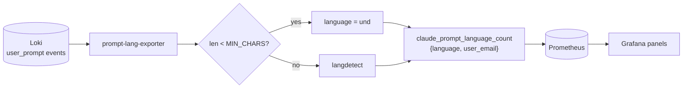

# Prompt-language exporter

Detects the natural language of each Claude Code prompt and exposes per-language /
per-developer counts to Prometheus for the "Prompt Language" panels in Grafana.

- **Source:** `user_prompt` events in Loki (requires `OTEL_LOG_USER_PROMPTS=1` so the
  prompt *text* is logged, not just the count).
- **Detector:** [`langdetect`](https://pypi.org/project/langdetect/) — pure Python,
  offline, free, ~1,300 prompts/sec, deterministic (`seed=0`). Prompts under
  `MIN_CHARS` are labelled `und` (langdetect is unreliable on ultra-short text).

## Metrics

| Metric | Labels | Meaning |
|--------|--------|---------|
| `claude_prompt_language_count` | `language`, `user_email` | prompts by language and developer (lookback window) |
| `claude_prompt_language_prompts_total` | — | prompts processed last poll |
| `claude_prompt_lang_exporter_last_success_timestamp` | — | last good poll |
| `claude_prompt_lang_exporter_errors` | — | 1 if last poll failed |

## Config (env)

| Var | Default | Notes |
|-----|---------|-------|
| `LOKI_URL` | `http://loki:3100` | |
| `LOOKBACK_DAYS` | `30` | matches Loki retention (720h) |
| `POLL_INTERVAL_SECONDS` | `3600` | hourly |
| `MIN_CHARS` | `20` | shorter plain-ASCII prompts → `und` |
| `NONASCII_MIN_CHARS` | `8` | shorter floor for dense non-ASCII (CJK/diacritic) text |
| `NONENGLISH_MIN_CHARS` | `25` | a non-English label is only trusted on text this long — below it one stray diacritic flips a short English prompt (`"Regểnate docx"` → `ro`) |
| `LANG_CONFIDENCE` | `0.90` | min detector confidence to accept a language |
| `UND_FALLBACK` | `1` | fold a developer's `und`/ambiguous prompts into their dominant detected language (`0` keeps raw `und`) |
| `LOKI_QUERY` | `{service_name="claude-code"} \| event_name="user_prompt"` | |
| `TEXT_KEYS` | `prompt,prompt_text,body,message,content` | JSON keys tried for the prompt text |
| `EMAIL_KEYS` | `user_email,user.email,email` | keys/labels tried for the developer |

> The counts reflect the exporter's `LOOKBACK_DAYS` window (recomputed each poll),
> independent of the Grafana time picker. Panels are labelled accordingly.

## Prerequisite

The prompt **text** must be in Loki. Your existing panels only *count*
`user_prompt` events, which works even if only the count is logged. If
`claude_prompt_language_prompts_total` is > 0 but everything classifies as `und`,
prompt text isn't being logged — set `OTEL_LOG_USER_PROMPTS=1` in the Claude Code
telemetry config (managed-settings.json / MDM).
