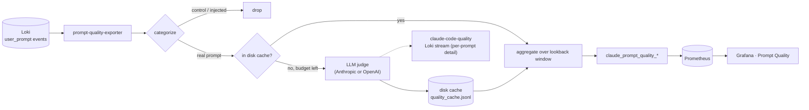

# Prompt-quality exporter

Scores each Claude Code developer prompt against a 4-dimension best-practice
rubric — **clarity**, **specificity**, **structure**, **robustness** (see
`quality_rubric.py`) — and exposes per-dimension / tier / issue averages to
Prometheus for the **Prompt Quality** Grafana dashboard.

Unlike `prompt-intent-exporter` (a free local ONNX model), scoring here calls a
paid LLM per prompt, so cost is actively managed:

- **Disk-persisted cache** (`CACHE_FILE`, on a mounted volume) — a container
  restart never re-scores (re-pays for) a prompt it already scored.
- **`MAX_NEW_PER_POLL`** caps how many brand-new prompts get scored per poll —
  a large backlog (e.g. first run) drains gradually instead of one cost spike.
- **`claude_prompt_quality_exporter_cost_usd_total`** gauge tracks cumulative
  estimated spend since the exporter started.
- Smaller default lookback (`LOOKBACK_DAYS=7` vs. intent's 29) — this is a
  scoring cost, not a free aggregation, so the default window is narrower.

## Metrics

| Metric | Labels | Meaning |
|--------|--------|---------|
| `claude_prompt_quality_overall_avg` | `user_email` | avg overall score (0-100) over the lookback window |
| `claude_prompt_quality_dimension_avg` | `dimension`, `user_email` | avg per-dimension score (1-5) |
| `claude_prompt_quality_tier_count` | `tier`, `user_email` | prompt count by tier (poor/fair/good/excellent) |
| `claude_prompt_quality_top_issue_count` | `top_issue`, `user_email` | prompt count by limiting issue |
| `claude_prompt_quality_prompts_total` | — | real prompts in the lookback window with a score |
| `claude_prompt_quality_exporter_new_scored_last_poll` | — | prompts newly LLM-scored last poll (cost driver) |
| `claude_prompt_quality_exporter_cost_usd_total` | — | cumulative estimated USD spent since start |
| `claude_prompt_quality_exporter_last_success_timestamp` | — | last good poll |
| `claude_prompt_quality_exporter_errors` | — | 1 if last poll failed |

Per-prompt detail (score, tier, top_issue, each dimension) is also written to
the `claude-code-quality` Loki stream (`service_name="claude-code-quality"`),
timestamped at the original prompt time, for a "worst prompts" drilldown table
that honors Grafana's time picker.

## Config (env)

| Var | Default | Notes |
|-----|---------|-------|
| `LOKI_URL` | `http://loki:3100` | |
| `LOOKBACK_DAYS` | `7` | narrower than intent's 29d — scoring costs money |
| `POLL_INTERVAL_SECONDS` | `3600` | hourly |
| `MAX_NEW_PER_POLL` | `300` | cap on newly-scored prompts per poll (cost guard) |
| `CACHE_FILE` | `/cache/quality_cache.jsonl` | mount a volume here so restarts don't re-spend |
| `WORKERS` | `8` | concurrent LLM calls per poll |
| `SCORER_PROVIDER` | `auto` | `auto` picks Anthropic if `ANTHROPIC_API_KEY` is set, else OpenAI if `OPENAI_API_KEY` is set |
| `SCORER_MODEL` | `claude-sonnet-5` | Anthropic model |
| `SCORER_OPENAI_MODEL` | `gpt-4o-mini` | OpenAI fallback model |
| `SCORER_EFFORT` | `low` | Anthropic `output_config.effort` |
| `WRITE_LOKI` | `1` | set `0` to disable the per-prompt Loki writeback |

Needs `ANTHROPIC_API_KEY` and/or `OPENAI_API_KEY` in the stack's `.env`.

## Rubric

Same rubric as `prompt-intent-classifier/src/quality_rubric.py` (vendored here
so this exporter's Docker build context stays self-contained, same convention
as the other exporters). Keep the two in sync by hand if the rubric changes.
