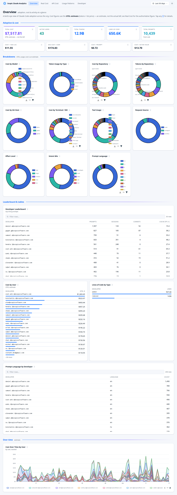

# `web/` — Next.js analytics dashboards (Grafana replacement)

A Next.js 15 (App Router, RSC) + TypeScript app that replaces the Grafana
dashboard suite for Claude Code ROI analytics. It reads the **same Prometheus +
Loki** the Grafana stack uses — no changes to ingestion, storage, or the
exporters — and adds richer interaction (theming, a comprehensive time picker,
searchable tables, per-metric explanations) that's awkward in Grafana.



## Dashboards

| Route | Audience | What it shows |
| --- | --- | --- |
| `/overview` *(default)* | Exec / org | Cost, adoption, tokens, LOC; breakdowns (model/project/repo/IDE/host/tool/intent/effort/source/language); leaderboard; cost-over-time. |
| `/real-cost` | Finance | Authoritative billed cost (seat fees + overage) vs. the OTEL estimate; per-developer cost; OTEL usage + breakdowns; exporter health. |
| `/usage-patterns` | Team enablement | Engagement leaderboard, intent/behaviors/slash-commands, workflow style, prompt-craft stats, per-developer tables, prompt volume. |
| `/developer?user=…` | 1:1 deep dive | One developer's cost/efficiency KPIs, breakdowns, cost/prompts/LOC over time, weekly activity heatmap, prompt patterns. Searchable user picker. |

## Features

- **Light / dark theme** — follows the OS by default, with a switcher (`next-themes`); all charts are theme-aware.
- **Comprehensive time range** — presets from 1 hour to 1 year plus a custom from/to range, encoded in the URL (`?range=` / `?from=&to=`) so views are shareable.
- **Per-metric ⓘ explanations** — every panel has an info popover: what it measures, the data source, and how it's calculated (`src/lib/metric-docs.ts`).
- **Searchable / filterable tables**; bar charts for discrete counts (empty periods stay visible); a weekly **activity heatmap** at hourly resolution.
- **Auth** — optional Keycloak SSO + a local break-glass login, behind `AUTH_ENABLED` (off ⇒ open).

## Architecture

```
Browser ─▶ Next.js (RSC, streamed via <Suspense>)
                │  server-only, cached data layer  (src/lib/data/*)
                ├─▶ Prometheus  /api/v1/{query,query_range}   (typed + Zod)
                └─▶ Loki        /loki/api/v1/{query,query_range}
```

- **Server-only datasource access** — URLs/secrets never reach the browser.
- **Queries-as-code** — every PromQL/LogQL string lives in the per-dashboard
  data layer, copied from the Grafana JSON with macros (`$__range`/`$__interval`)
  resolved.
- **Reductions** use a range query + last-not-null over a **coarse step**: seed/
  relayed data can be stale at `now`, so an instant-at-now query returns nothing;
  a coarse range reliably captures the value cheaply.
- **Concurrency pools** (instant vs range, per datasource) stop a slow time-series
  scan from starving fast donut/scalar queries → no spurious "No data".
- **Two-layer cache** — `unstable_cache` keyed by `(section, range-token)` over
  fetch `revalidate` (default 5 min). Note: `unstable_cache` persists to
  `.next/cache`; clear it (or bump keys) when query logic changes.

### Metric correctness notes (non-obvious)

- **cost / tokens / LOC / active-time** are resetting counters → aggregate with
  `increase()`.
- **sessions / commits / pull-requests** are *per-`session_id` cumulative*
  counters with ~1–3 samples per series, so `increase()` silently returns 0 or
  undercounts. They use `sum(max_over_time(…))` (commits/PRs) and
  `count(count_over_time(…))` (distinct sessions) instead.
- **Cost efficiency** is shown per **1M tokens** (the unit pricing uses); per-1k
  rounds to $0.00.

## Run

```bash
cd web && npm install
cp .env.example .env.local          # PROMETHEUS_URL / LOKI_URL (+ auth if wanted)

npm test            # 20 unit
npm run typecheck
npm run build && npm start          # http://localhost:3000  → /overview
# or: npm run dev

npm run e2e         # 13 functional (Playwright, system Chrome)
npm run e2e:auth    # 5 auth-flow
npm run e2e:visual  # 8 visual-regression (4 pages × light/dark; --update-snapshots to refresh)
```

Docker (joins the main stack):

```bash
docker compose -f docker-compose.yml -f web/docker-compose.web.yml up -d web
```

## Layout

```
src/app/{overview,real-cost,usage-patterns,developer}/{page,sections,skeletons}.tsx
src/components/  app-shell, nav-tabs, time-picker, theme-switcher, user-select,
                 info-button, kpi-card, data-grid, data-table, charts/*
src/lib/data/    common.ts (helpers, cache) + one module per dashboard + users.ts
src/lib/         prometheus/, loki/, time-range.ts, metric-docs.ts, format.ts, auth*
e2e/             *.spec.ts + global-setup + visual baselines
```

## Out of scope / next steps

- Route-level `loading.tsx` skeletons to make cold time-range/user switches feel instant.
- Timezone toggle for the activity heatmap (currently UTC).
- CI job running the three Playwright suites.
- Verify Keycloak against a real IdP (redirect URI `…/api/auth/callback/keycloak`).
```
